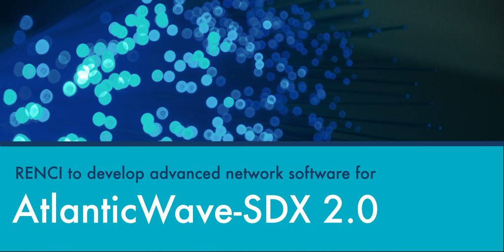

Sharing big data requires big networks. Systems like [AtlanticWave-SDX](\"https://www.atlanticwave-sdx.net/\"), which connects networks in the U.S., Chile, Brazil, and South Africa, provide specialized infrastructure needed to send vast amounts of scientific data across long distances, helping scientists make the most of powerful data collections.

RENCI scientists contributed to the development of AtlanticWave-SDX, a distributed experimental software-defined exchange (SDX) that uses cutting-edge network technology to facilitate the exchange of data between research and education networks in the U.S. with networks on other continents.

Now, RENCI will play a leading role in software development and testing for AtlanticWave-SDX 2.0\. The five-year project, supported by a recent $6.5-million award from the U.S. National Science Foundation (NSF), is led by [Florida International University](\"https://www.fiu.edu/\") and also includes the [University of Southern California](\"https://www.usc.edu/\").

### Why are open exchange points needed?

AtlanticWave-SDX allows researchers to efficiently and reliably transmit far more data than could be sent with normal Internet linkages. For example, AtlanticWave-SDX is critical for research at the Vera C. Rubin Observatory in Chile. This telescope sweeps the sky every night to create a deep survey of space that, over ten years, will create a 500-petabyte set of images and data. Although the clear skies and dry air in Chile are the best location for large telescopes like this one, the computing power to process and store the data is in the United States and other parts of the world. For this application alone, 20 terabytes of data are produced each night and must be quickly, securely, and reliably transmitted to the U.S.

Transferring large amounts of data over such long distances presents challenges that don’t exist with the traditional telecommunication networks that support normal web traffic. For one, extremely high bandwidth is needed to move this data quickly without gumming up a network that is used by many institutions for various types of applications. To avoid interruptions that might result in data loss, the network must also reroute traffic if there is a hard failure such as a break in the fiber or a hardware problem.

"The most challenging aspect is dealing with what are known as soft failures, which can be caused by interference or other hard-to-detect problems," said Yufeng Xin, leader of the RENCI research team. "Although occasional soft failures don’t usually cause problems for normal networks, when there is extremely high throughput, even a low failure rate can cause the whole network to slow down dramatically."

To deal with these soft failures, AtlanticWave-SDX uses network technology known as software-defined networking. This approach creates a centralized controller that provides real-time monitoring of the network and, using software, can quickly reprogram or reconfigure network devices to meet the data transfer requirements of the applications using the exchange at that time.

### More intelligent networking

The new NSF funding will support hardware upgrades and the development of new software that will enable new functions for AtlanticWave-SDX, upgrade the overall network, and make the way the network connects to the data sources and destinations more efficient and intelligent. AtlanticWave-SDX 2.0 will be based on an emerging Internet technology known as P4, which offers increased flexibility to reprogram how the network performs. The P4 paradigm also allows the system to gather real-time network monitoring data, which can be used to quickly detect any network misbehavior.

"The software to support this new Internet paradigm is in early stages," said Xin. "The RENCI team will be extending the software to create new network monitoring and analysis capabilities that integrate the latest machine learning technologies. Once the monitoring piece is in place, new control actions can be developed so that the network can automatically respond to problems."

The P4-enabled SDX software systems that will be developed are extremely complex and have several pieces that will be deployed in different parts of the network. This makes the testing and deployment both complicated and essential.

"RENCI has the ability to mimic network devices and the overall network environment so that the software we develop can be thoroughly tested before deployment," said Xin. "We also have experience in DevOps software engineering, which we’ll be using to shorten the software development and deployment cycle."

Once complete, the new version of AtlanticWave-SDX will leverage the very latest networking technology and advanced functions to support even more complex data transfer for scientific endeavors around the world.

More information about the project is available at [https://www.atlanticwave-sdx.net/](\"https://www.atlanticwave-sdx.net/\").

_By Nancy Lamontagne, Senior Science Writer, Creative Science Writing_

