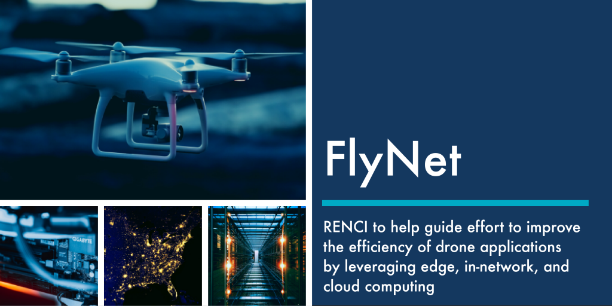

The Renaissance Computing Institute (RENCI) at the University of North Carolina at Chapel Hill will [collaborate on a $749,998, two-year effort to develop new architectures and tools for the safe, efficient, and economic operation of drones](https://www.umass.edu/newsoffice/article/umass-amherst-led-research-team-receives). The funding was awarded by the National Science Foundation (NSF).

Led by the [University of Massachusetts Amherst](https://www.umass.edu/), scientists from [RENCI](https://renci.org/), the Information Sciences Institute ([ISI](https://www.isi.edu/)) at the University of Southern California ([USC](https://www.usc.edu/)), and the [University of Missouri,](https://missouri.edu/) will collaborate on FlyNet, a project that will utilize edge, cloud, and in-network computing to generate crucial data that will help them address a variety of pressing issues presented by drones.

As the use of drone technology becomes common, the challenges associated with its characteristics and flight modalities become more apparent. Drones require very detailed, close-to-the-ground weather information for safe operations, and their on-the-fly data processing and energy consumption must be handled intelligently. 

The NSF FlyNet project will provide an architecture and tools that will enable scientists to integrate in-network, cloud, and edge computing devices to reduce the latency of applications such as drone video analytics and  route planning. Within this intuitive network platform, scientists will be able to offload different portions of the drone applications to separate points in the latency spectrum from edge to core cloud computing.

RENCI will contribute expertise through its projects [DyNamo](https://nrig.renci.org/project/dynamo-delivering-a-dynamic-network-centric-platform-for-data-driven-science/) and [FABRIC](https://fabric-testbed.net/). The DyNamo project has built a network platform called Mobius that is integrated with [Pegasus](https://pegasus.isi.edu/) and will be used to support FlyNet applications. Pegasus, a project led by USC ISI, will be leveraged for managing workflows for drone route path planning and drone video analytics. Pegasus also has a role in aiding the optimization process to find the placement of drone computations at different points of the latency spectrum. Additionally, RENCI will integrate FABRIC into the infrastructure to be leveraged for in-network processing that will aid the scientists to process parts of the drone workflows within the core FABRIC network. 

FABRIC itself plays a large role in the FlyNet project. A primary goal of the FlyNet project is to bridge the abstraction gap between the scientists and their usage of the FABRIC infrastructure. FABRIC will be used to move high volume data collected from the drones and cameras through the network. With support from RENCI’s implementation of the DyNamo network platform, Mobius, FABRIC’s in-network processing will allow operation on the data while the data is being shipped through the network. The FABRIC infrastructure also includes core network nodes which each have different computing capacities that can be leveraged for in-network processing. 

“We’re excited to see how we can help advance drone capabilities through our work here at RENCI,” said [Anirban Mandal](https://nrig.renci.org/staff/anirban-mandal/), assistant director of the Network Research & Infrastructure Group at RENCI. “Part of the FlyNet charge for RENCI is to extend the Mobius platform and use application-centric programs to leverage these new in-network processing capabilities offered by FABRIC.”

The project team will enable access to a rich set of resources for researchers and educators from a diverse set of institutions, including historically black colleges and universities (HBCUs), community colleges, and women’s colleges, to further democratize research. In addition, collaboration with the NSF’s Research Experience for Undergraduates Sites in Computer Networking will promote participation of under-served/under-represented students in project activities.

More information about the project is available at [http://www.flynet-ci.org](https://www.flynet-ci.org).

_By Jayasree Jaganatha, Communications & Marketing Specialist, & Tanvi Krishnamurthy, Communications Intern, RENCI_
