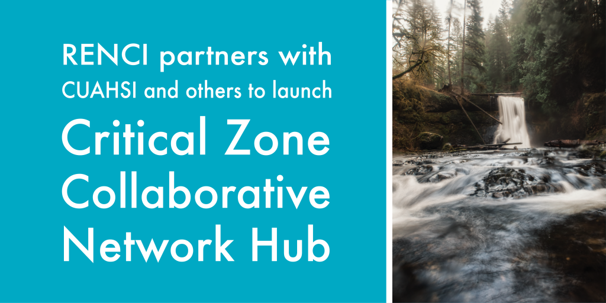

The Consortium of Universities for the Advancement of Hydrologic Science ([CUAHSI](https://www.cuahsi.org/)) has been selected to be the Coordinating Hub for the NSF-funded [Critical Zone (CZ) Collaborative Network](https://www.nsf.gov/pubs/2019/nsf19586/nsf19586.htm). 

Collaborators in this new venture include representatives from RENCI, the [US Geological Survey](https://www.usgs.gov/), [Pennsylvania State University](https://www.psu.edu/), [Utah State University](https://www.usu.edu/), and the [Lahmont-Doherty Earth Observatory](https://www.ldeo.columbia.edu/) of Columbia University. All members of the team have experience with Critical Zone Science and the previous [Critical Zone Observatory Network](http://criticalzone.org/national/).

Operation of the Hub will include four primary tasks:

1.  Enhance and integrate existing data services and establish cyberinfrastructure with a distributed architecture that links existing data facilities and services, including [HydroShare](https://www.hydroshare.org/), [EarthChem](https://www.earthchem.org/), [SESAR](https://www.geosamples.org/), [OpenTopography](https://opentopography.org/), and eventually other systems via a central Hub that provides services for easy data submission, integrated data discovery and access, and computational resources for data analysis and visualization.  
2.  Support discovery through community synthesis activities and via access to community data and modeling cyberinfrastructure.
3.  Broaden the CZ community through outreach and education activities.
4.  Enhance collaboration among the CZ Thematic Clusters through coordination, sharing, community meetings, and outreach. The nine CZ Thematic Clusters across the US conducting basic research into the structure, function, and processes of the critical zone are:

&nbsp;

*   CINet: Critical Interface Network in Intensively Managed Landscapes
*   The Coastal Critical Zone: Processes that transform landscapes and fluxes between land and sea
*   Bedrock controls on the deep critical zone, landscapes, and ecosystems
*   Dynamic Water Storage — Quantifying controls and feedbacks of dynamic storage on critical zone processes in western montane watersheds
*   Urban Critical Zone processes along the Piedmont-Coastal Plain transition
*   Patterns and controls of ecohydrology, CO2 fluxes, and nutrient availability in pedogenic carbonate-dominated dryland critical zones
*   Dust in the Critical Zone from the Great Basin to the Rocky Mountains
*   Using Big Data approaches to assess ecohydrological resilience across scales
*   Geomicrobiology and Biogeochemistry in the Critical Zone

RENCI’s role in the Hub will be to host the cyberinfrastructure for the CZ Hub data submission portal.
